<!-- ═══════════════════════════════════════════════════════════════════
     sushan9900 — GitHub Profile README
     Generated by: banner_gen.py (source of truth: dots_dark.npy, dots_light.npy)
     Phase 1 banner  : dark.svg / light.svg  (upload to repo root)
     Phase 2 stats   : replace YOUR_VERCEL_URL with your Vercel instance
     Phase 3 snake   : add AFTER "Generate Snake" Action runs green
     Phase 4 badges  : LinkedIn uses brand blue #0A66C2 (logo vanishes on custom color)
     ═══════════════════════════════════════════════════════════════════ -->

<!-- ── BANNER ────────────────────────────────────────────────────────── -->

<picture>
  <source media="(prefers-color-scheme: dark)"  srcset="dark.svg">
  <source media="(prefers-color-scheme: light)" srcset="light.svg">
  
</picture>

 

<!-- ── STATS ─────────────────────────────────────────────────────────── -->
<!-- Replace YOUR_VERCEL_URL with your deployed Vercel instance URL      -->
<!-- hide_rank=true: rank is weighted by stars received, not commits      -->
<!-- — misleading for accounts whose contributions are mostly private     -->
<h3 align="center">📊 Stats</h3>

<!-- Streak — full width (demolab has higher uptime than public GRS) -->

<!-- Stats + Top Langs — 49% + 49% -->

&nbsp;

 

<!-- ── SNAKE ─────────────────────────────────────────────────────────── -->
<!-- ⚠️  IMPORTANT: Only uncomment / add this section AFTER the          -->
<!-- "Generate Snake" GitHub Action runs green.                          -->
<!-- The `output` branch does NOT exist before then — the image URL      -->
<!-- will show a 404 broken image if you add it too early.              -->

<h3 align="center">🐍 Contribution Snake</h3>

<picture>
  <source
    media="(prefers-color-scheme: dark)"
    srcset="https://raw.githubusercontent.com/sushan9900/sushan9900/output/github-contribution-grid-snake-dark.svg">
  <source
    media="(prefers-color-scheme: light)"
    srcset="https://raw.githubusercontent.com/sushan9900/sushan9900/output/github-contribution-grid-snake.svg">
  
</picture>

 

<!-- ── BADGES ────────────────────────────────────────────────────────── -->
<!-- LinkedIn badge bug: the LinkedIn logo ONLY renders correctly on     -->
<!-- brand blue #0A66C2. On any other custom color, the glyph silently   -->
<!-- vanishes and only the text label appears. Use #0A66C2 for LinkedIn. -->
<!-- All other logos (Gmail, Vercel) recolor fine.                      -->
<h3 align="center">🔗 Connect</h3>

&nbsp;&nbsp;
&nbsp;&nbsp;

