<div align="center">

<!-- 1. Animated Header Section -->
<h1>⚡ SUSHAN ⚡</h1>
<p><b>SOFTWARE ENGINEER • AI & FULL STACK DEVELOPER</b></p>


<br/><br/>

[](#-about-me)
[](#)

<br/>

[](mailto:sushan9900@gmail.com)
[](https://github.com/sushan9900)

<br/>

[](https://github.com/sushan9900)

</div>

---

<!-- 2. About Section -->
## 🌌 About Me

Hi, I'm **Sushan**! I am a passionate **Software Engineer & Full Stack Developer** specializing in building intelligent web applications, AI-driven backend services, and real-time IoT solutions. I enjoy taking complex ideas and turning them into scalable, efficient software systems.

- ⚙️ **Software Engineering**: Strong foundation in Python, JavaScript, C++, and database design with a focus on clean, maintainable code.
- 🧠 **AI/ML & Data Science**: Hands-on experience developing ML microservices with FastAPI, Scikit-Learn, Pandas, NumPy, and local LLMs via Ollama.
- 💻 **Full Stack & Cloud**: Crafting dynamic frontends in React and Vite alongside backend services in Node.js, Express, Firebase, and Google Cloud Run.
- 🔌 **IoT & Embedded Systems**: Building end-to-end telemetry pipelines connecting ESP8266 hardware sensors to cloud dashboards in real time.
- 🤝 **Open To**: Software Engineering Roles, Full Stack Opportunities, AI/ML Projects, and Open Source Collaborations.

---

<!-- 3. Tech Stack Section -->
## 🛠 Tech Stack & Ecosystem

### 💻 Programming Languages


### 🎨 Frontend Engineering


### ⚡ Backend, Cloud & Databases


### 🧠 AI/ML & Developer Tools


<br/>

<div align="center">
  
</div>

---

<!-- 4. AI / ML Expertise Section -->
## 🧠 AI / ML Engineering Capabilities

| Domain | Proficiency | Key Frameworks & Technical Details |
| :--- | :---: | :--- |
| **Machine Learning & Analytics** | `Advanced` | Scikit-Learn, Pandas, NumPy, Risk Analysis, Regression & Classification |
| **AI Microservices & APIs** | `Advanced` | FastAPI, Uvicorn, REST Endpoints, Cloud Run Deployment |
| **Local LLMs & GenAI Tools** | `Intermediate` | Ollama, Prompt Engineering, Streamlit Application Prototyping |
| **Deep Learning Fundamentals** | `Intermediate` | Keras, Neural Networks, Image Embeddings |
| **Telemetry & Data Pipelines** | `Advanced` | Real-time Sensor Ingestion, Firebase Sync, Chart.js Dashboards |

---

<!-- 5. Featured Projects Section -->
## 🚀 Featured Projects

<details>
<summary><b>⚡ SmartSphere — Complete IoT & AI Environmental Monitoring Platform</b></summary>

<br/>

> **End-to-end IoT platform featuring ESP8266 firmware, real-time sensor processing, FastAPI AI risk engine, and React dashboard.**

| Metric / Property | Specification |
| :--- | :--- |
| **Stack** | `ESP8266 / C++` • `FastAPI` • `Scikit-Learn` • `React/Vite` • `Firebase` • `Cloud Run` |
| **Sensors** | MQ-2 Gas, Capacitive Moisture, HC-SR04 Ultrasonic |
| **Key Features** | Real-time risk scoring, flood probability estimation, automated alerts |
| **Repository** | [`github.com/vaibhavvm2005/APEX_API_SMART_SPHERE`](https://github.com/vaibhavvm2005/APEX_API_SMART_SPHERE) |

#### Project Highlights
SmartSphere captures live telemetry from hardware nodes via MQTT/HTTP, processes environmental readings through a Python AI engine using Scikit-Learn, and updates a live React dashboard backed by Firebase Realtime Database.

</details>

<details>
<summary><b>📊 Carbon Analytics & Backend Microservice App</b></summary>

<br/>

> **Full stack web application built with Node.js, Express, and MySQL for tracking metrics and analytics.**

| Metric / Property | Specification |
| :--- | :--- |
| **Stack** | `Node.js` • `Express` • `MySQL` • `React` |
| **Key Features** | REST API endpoints, relational schema design, modular middleware |
| **Repository** | [`github.com/sushan9900/carbon-app`](https://github.com/sushan9900) |

#### Project Highlights
Engineered modular Node.js API handlers for structured data persistence and dynamic metric visualization.

</details>

---

<!-- 6. Experience Section -->
## 💼 Engineering Experience & Projects

### Software & AI Developer | Independent Projects
*2023 – Present*
- Built end-to-end IoT and AI platforms integrating hardware microcontrollers with cloud container services.
- Architected RESTful microservices in Python (FastAPI) and Node.js with database schemas in PostgreSQL, MySQL, and Firebase.
- Developed dynamic single-page web applications using React, Vite, and modern CSS frameworks.
- Skills: `Python` `FastAPI` `React` `Node.js` `Firebase` `Scikit-Learn` `C++` `IoT`

---

<!-- 7. Achievements Section -->
## 🏆 Achievements & Highlights

<div align="center">

| Milestone | Details |
| :--- | :--- |
| **🚀 SmartSphere IoT Platform Deployment** | Successfully integrated ESP8266 firmware, Cloud Run FastAPI AI backend, and Firebase dashboard |
| **⚡ Multi-Stack Mastery** | Hands-on proficiency across Python AI tools, Node.js backend services, and modern React frontends |
| **🌟 Open Source & Collaboration** | Active contributor and developer exploring AI, IoT, and cloud technologies |

</div>

---

<!-- 8. Certifications Section -->
## 📜 Certifications & Training

#### Python & Machine Learning
[](#)

#### Web Development & Cloud
[](#)

---

<!-- 9. Coding Profiles Section -->
## 🧩 Coding Profiles

<div align="center">

[](https://leetcode.com/sushan9900)
[](https://geeksforgeeks.org/user/sushan9900)
[](https://hackerrank.com/sushan9900)

</div>

---

<!-- 10. Contribution Activity Section -->
## 📈 Contribution Activity Graph

<div align="center">


</div>

---

<!-- 11. Multi-Snake Contribution Graph -->
## 🐍 Multi-Snake Contribution Graph

<div align="center">
  <picture>
    <source media="(prefers-color-scheme: dark)" srcset="https://raw.githubusercontent.com/sushan9900/sushan9900/output/github-contribution-snake-dark.svg">
    <source media="(prefers-color-scheme: light)" srcset="https://raw.githubusercontent.com/sushan9900/sushan9900/output/github-contribution-snake-light.svg">
    
  </picture>
</div>

---

<!-- 12. Current Focus Section -->
## ⚡ Current Focus & Engineering Roadmap

```yaml
Current Focus:
  Learning:
    - Advanced Machine Learning model deployment & optimization
    - Deepening Cloud-Native DevOps & Docker orchestration
  Building:
    - SmartSphere IoT AI risk prediction engine with FastAPI
    - Modern Full Stack web applications with React & Node.js
  Exploring:
    - Local LLM integrations with Ollama & LangChain
    - Real-time telemetry visualization pipelines
  Open To:
    - Software Engineering Roles
    - Full Stack Developer Positions
    - Collaborative AI & IoT Open Source Projects
```

---

<!-- 13. Connect Section -->
## 🤝 Connect & Network

<div align="center">

[](mailto:sushan9900@gmail.com)
[](https://github.com/sushan9900)

</div>

---

<!-- 14. Footer Section -->
<div align="center">

*"Simplicity is prerequisite for reliability, but elegance is the hallmark of true engineering excellence."*

</div>
